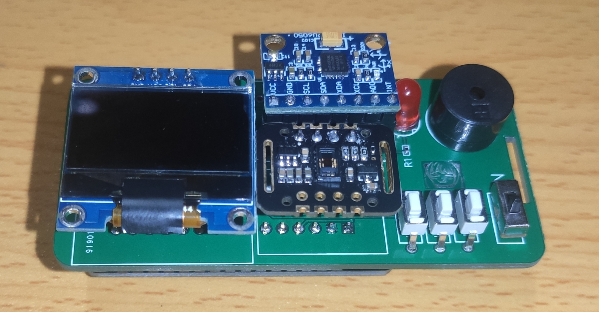
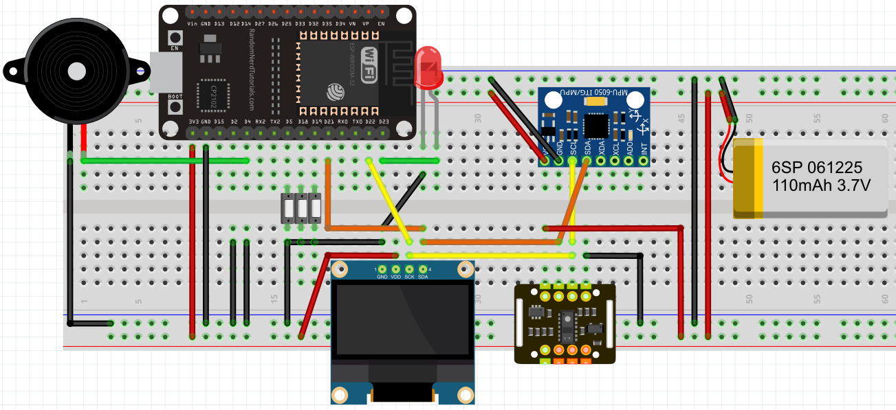

# ESP32-SmartBand
> 这是大学三年级的实训项目。
>
## PCB效果

## 连线

## 演示视频

[B站视频](https://www.bilibili.com/video/BV1it4y1s7AY?spm_id_from=333.999.0.0)

## 关于取模

[汉字取模](https://www.23bei.com/tool/965.html)

[图片取模](https://javl.github.io/image2cpp/)

[GIF取模](https://www.arduino.cn/thread-104936-1-1.html)