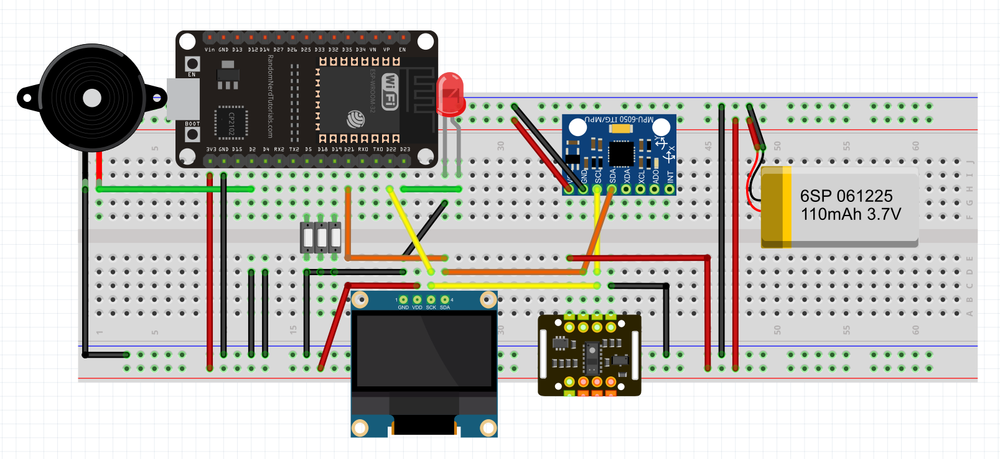

# ESP32-SmartBand
> 这是大学三年级的实训项目。
>
> 老师要求：本课题设计一个健康智能手环，针对亚健康或生病人群实时监控其基本生命指标，以及作息提醒。硬件电路包括MCU、心率血氧传感器、显示模块、电源模块、控制按键电路、蜂鸣器、LED灯等。该设计实现智能手环实时显示心率和血氧，超过限值声光报警（LED灯闪烁、蜂鸣器响）。还可实现按时喝水、按时吃药等提醒。选做加分：计步器，手机APP。   
## 连线

## 演示视频

B站指路：https://www.bilibili.com/video/BV1Cf4y1y7KT/

## 关于取模

[汉字取模](https://www.23bei.com/tool/965.html)

[图片取模](https://javl.github.io/image2cpp/)

[GIF取模](https://www.arduino.cn/thread-104936-1-1.html)